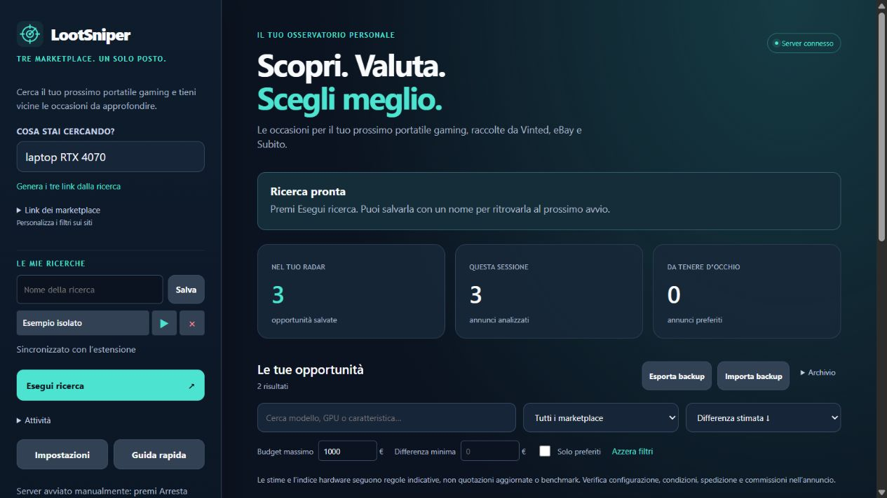
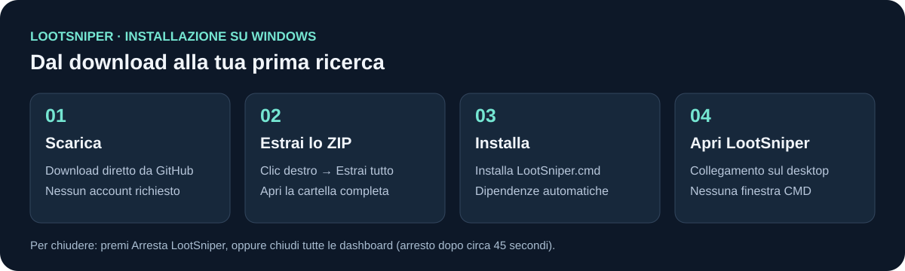
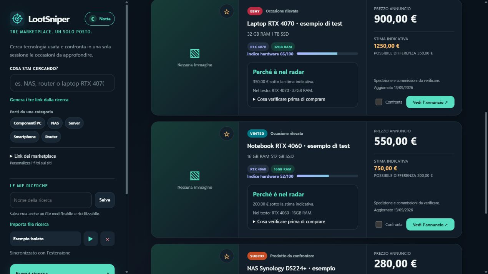
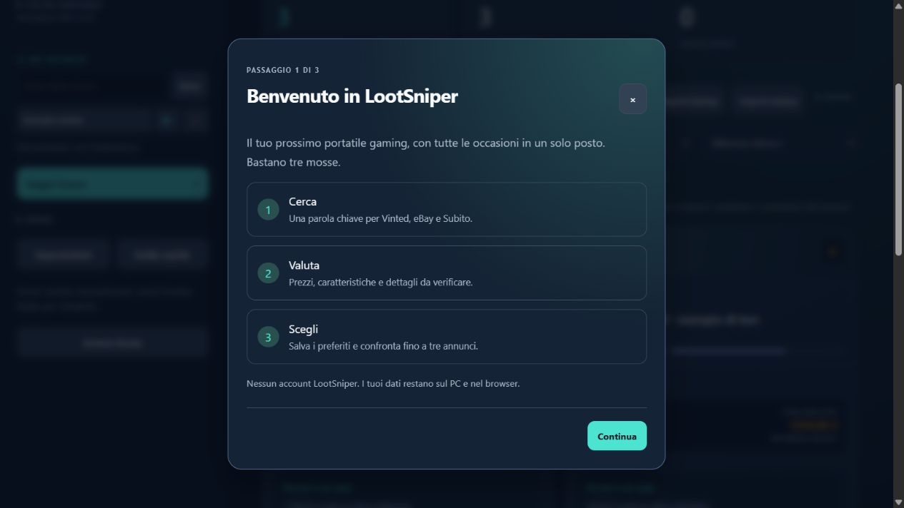
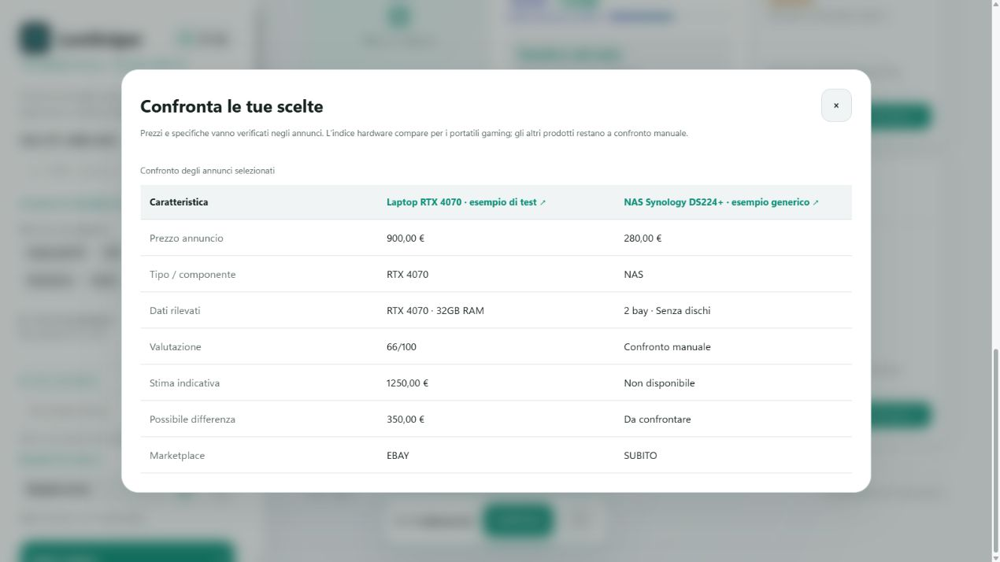
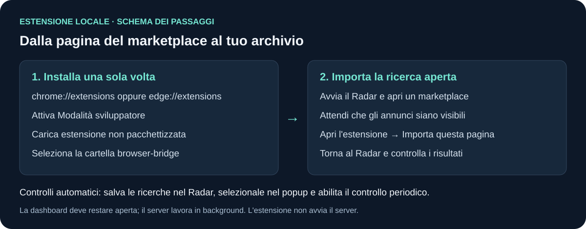
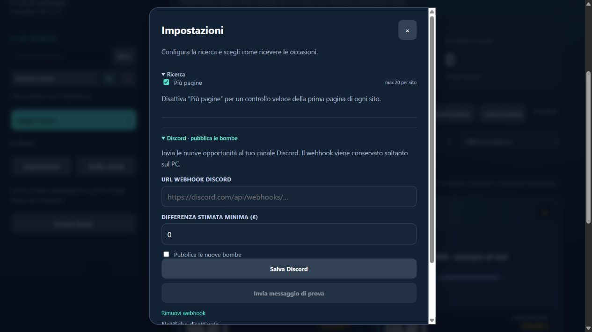

# LootSniper · radar tecnologico in locale

Cerca e confronta portatili gaming, NAS, router e altra tecnologia usata su **Vinted, eBay e Subito**. Il programma apre automaticamente una dashboard locale nel browser.

**Questa versione si esegue esclusivamente in locale.** GitHub distribuisce il progetto e la guida: non devi attivare GitHub Pages, configurare Supabase o inserire chiavi API. Per cercare nuovi annunci serve una connessione Internet; l’archivio già salvato si può consultare anche senza connessione.



*Le schermate di questa guida usano annunci sintetici di test, non offerte reali.*

## Installazione semplice per Windows

[⬇️ **Scarica LootSniper per Windows**](https://github.com/Fr3nK027/LootSniper/archive/refs/heads/main.zip)

1. Estrai completamente lo ZIP scaricato.
2. Apri la cartella estratta e fai doppio clic su **Installa LootSniper.cmd**.
3. Attendi il messaggio **Installazione completata**: si aprirà la dashboard e troverai **LootSniper** sul desktop e nel menu Start.

Non servono privilegi di amministratore, Python, pip o Node.js. L’installer:

- installa il programma in `%LOCALAPPDATA%\Programs\LootSniper`;
- scarica una copia privata e isolata di Python 3.14.7 dal sito ufficiale Python;
- controlla il file scaricato con l’hash SHA-256 pubblicato da Python.org prima di estrarlo;
- crea i collegamenti con l’icona LootSniper;
- avvia dashboard e server senza lasciare finestre CMD nella barra delle applicazioni.

Il runtime rimane dentro l’installazione di LootSniper: non modifica il Python già presente sul PC e non aggiunge variabili di sistema. I componenti dell’app usano soltanto la libreria standard, quindi non vengono scaricati pacchetti da fonti aggiuntive. Dettagli: [pacchetto Python incorporabile](https://docs.python.org/3/using/windows.html#the-embeddable-package) e [Python 3.14.7](https://www.python.org/downloads/release/python-3147/).



Windows può mostrare un avviso perché lo script non è firmato digitalmente. Verifica che lo ZIP provenga dal repository `Fr3nK027/LootSniper`; quindi apri **Ulteriori informazioni → Esegui comunque** se l’avviso compare.

## Primo avvio

La prima apertura mostra una guida in tre passaggi. Inserisci cosa cerchi e, se vuoi, il budget: LootSniper prepara automaticamente i link per Vinted, eBay e Subito. La guida rimane sempre disponibile con **Guida rapida**.

Il pulsante **Giorno / Notte** accanto al logo cambia l’aspetto della dashboard e ricorda la scelta. Al primo avvio LootSniper segue automaticamente il tema di Windows.





In seguito usa soltanto il collegamento **LootSniper** sul desktop o nel menu Start: server e dashboard si aprono automaticamente. LootSniper impedisce l’avvio contemporaneo di più server sulla stessa porta, così la dashboard comunica sempre con una sola versione. Non occorre cercare o digitare `127.0.0.1:8765`; quell’indirizzo serve solo come riferimento tecnico per la versione attuale.

Per chiudere subito premi **Arresta LootSniper** nella barra laterale. Chiudendo tutte le schede della dashboard, il server termina automaticamente dopo circa 45 secondi; se il browser si arresta senza avvisare, la pulizia avviene dopo circa 3 minuti. Non rimane un CMD da chiudere.

### Uso portatile e avvio dal terminale

Se preferisci non installare il programma, serve Python 3.10 o successivo. Estrai lo ZIP e fai doppio clic su **avvia radar.vbs**, oppure apri un terminale nella cartella:

```powershell
py -3 launcher.py --background
```

In alternativa:

```text
python launcher.py --background
```

Su macOS e Linux puoi usare `python3 launcher.py --background` con Python 3.10+; installer, VBS e BAT sono specifici per Windows. I controlli effettuati per questa distribuzione sono su Windows.

Per la diagnostica con terminale visibile usa `python launcher.py` e chiudi con **Ctrl+C**. Per avviare soltanto il server usa `python server.py`: l’arresto alla chiusura delle schede è attivo solo con `--auto-stop`. Il pulsante **Arresta LootSniper** funziona anche in modalità manuale.

## Esegui una ricerca

1. Nel campo **Cosa stai cercando?** scrivi, per esempio, `NAS Synology economico`, `router Wi-Fi 7` oppure `laptop RTX 4070`.
2. Premi **Genera i tre link dalla ricerca**.
3. Se vuoi filtri specifici, apri il marketplace, imposta i filtri sul sito e copia l’URL nel campo Vinted, eBay o Subito corrispondente.
4. Lascia vuoti i campi delle piattaforme che non vuoi interrogare. Se cambi nuovamente la ricerca rapida, i link possono essere rigenerati.
5. In **Impostazioni → Ricerca** attiva **Più pagine** per leggere fino a 20 pagine per sito.
6. Premi **Esegui ricerca** e segui il messaggio di stato. Il riquadro **Attività** contiene i dettagli tecnici.
7. Per fermare il lavoro premi **Interrompi ricerca**: quanto raccolto rimane salvato.

Ogni volta che premi **Esegui ricerca**, LootSniper svuota il radar precedente e riparte da zero. Anche un nuovo avvio azzera annunci, preferiti, filtri, importazioni e l’elenco temporaneo delle ricerche. Tema, configurazione Discord e file ricerca già scaricati rimangono disponibili.

Per i portatili gaming riconosciuti, LootSniper evidenzia quelli con prezzo inizialmente entro il 95% della stima indicativa. NAS, router e altri prodotti vengono comunque mostrati e ordinati per prezzo: in questi casi la valutazione è manuale perché non viene inventata una quotazione senza dati affidabili.

Per l’elettronica generica, LootSniper evidenzia soltanto caratteristiche scritte nell’annuncio: memoria, archiviazione, numero di bay, standard Wi-Fi, velocità di rete, 5G e Dual SIM. Nella tabella di confronto le stime non disponibili restano esplicitamente indicate come **confronto manuale**.

Alcuni marketplace possono bloccare la lettura diretta o caricare gli annunci soltanto nel browser. In questi casi usa l’estensione descritta al passo 6.

### Salva una ricerca

1. Prepara i link.
2. Scrivi un nome in **Nome della ricerca**.
3. Imposta, se servono, budget, differenza minima, marketplace, ordinamento e **Più pagine**.
4. Premi **Salva**. Il browser scarica un file con un nome come `LootSniper-NAS-economici.json`.
5. Durante la sessione premi il nome per ricaricare la ricerca, **▶** per eseguirla o **×** per rimuoverla dall’elenco.
6. In futuro premi **Importa file ricerca**, scegli il JSON e controlla i dati caricati. Premi **Esegui ricerca** per avviarla.

Il file conserva nome, parole chiave, marketplace, eventuali URL personalizzati, budget, filtri, ordinamento e profondità della scansione. Non contiene risultati, preferiti o webhook Discord. Puoi conservarlo in qualsiasi cartella, inviarlo a un altro PC con LootSniper o modificarlo con Blocco note.

Nel JSON, modifica liberamente `name`, `query`, `filters` e `deepScan`. Dentro `marketplaces` usa:

- `true` per creare automaticamente il link del marketplace dalla nuova `query`;
- `false` per escludere quel marketplace;
- un URL HTTPS completo per mantenere filtri personalizzati impostati sul sito.

Questo formato non dipende dal tipo di prodotto: puoi creare profili per PC gaming, componenti, NAS, server, cellulari, router, monitor e altra elettronica. Conserva virgolette, virgole e parentesi del JSON; se la sintassi non è valida, LootSniper rifiuta il file e mostra il motivo senza cambiare la ricerca corrente.

L’elenco interno è condiviso con l’estensione soltanto durante la sessione e viene azzerato al riavvio. I file scaricati non vengono cancellati: sono il modo previsto per riutilizzare una ricerca in una sessione futura.

## Valuta, filtra e confronta

- Il catalogo parte in modalità **Lista**: immagine a sinistra, caratteristiche e controlli al centro, prezzo e azioni a destra. È pensato per confrontare rapidamente componenti ed elettronica con una struttura familiare.
- Premi **Griglia** per una vista più compatta; LootSniper ricorda la vista scelta sul PC.
- Cerca un modello o una caratteristica nei risultati.
- Filtra per marketplace, budget massimo e differenza minima.
- Filtra per categoria: portatili gaming, componenti PC, NAS, router e rete, server, smartphone o altra elettronica. Il menu mostra quanti annunci sono presenti in ogni categoria.
- Il menu Marketplace mostra quanti annunci arrivano da Vinted, eBay e Subito, così sai subito dove si concentra il catalogo.
- Imposta un prezzo minimo e massimo per restringere il catalogo a una fascia precisa; entrambi vengono conservati nei file ricerca riutilizzabili.
- Se il prezzo minimo supera il massimo, il catalogo indica subito come correggere la fascia invece di confonderla con una ricerca senza risultati.
- Attiva **Solo con foto** quando vuoi escludere gli annunci senza immagine; anche questa scelta viene conservata nel file ricerca.
- I filtri applicati compaiono sopra gli annunci: premi **×** su un singolo filtro per rimuoverlo senza perdere gli altri.
- Premi la **stella** sulla scheda per salvarla nei preferiti.
- Usa **Solo preferiti** per restringere l’archivio.
- Scegli l’ordinamento; **Mostra altri 60 annunci** carica le schede successive.
- Apri rapidamente un’offerta sul marketplace premendo la sua immagine, il titolo oppure **Vedi l’annuncio**.
- Leggi **Perché è nel radar** e apri **Cosa verificare prima di comprare**: LootSniper distingue i dati riconosciuti nel testo da quelli ancora mancanti.

Le scorciatoie **Componenti PC**, **NAS**, **Server**, **Smartphone** e **Router** preparano subito i tre marketplace. La parola chiave resta modificabile prima dell’avvio, quindi puoi precisare marca, modello, capacità o qualsiasi altra caratteristica.

Per confrontare due o tre annunci:

1. Seleziona **Confronta** sulle rispettive schede.
2. Premi il pulsante **Confronta** nella barra in basso.
3. Leggi la tabella e chiudila con **×** oppure **Esc**.



**Stime e indice hardware sono indicativi:** non sono quotazioni aggiornate, benchmark o una garanzia di rivendita. Controlla prezzo, configurazione, condizioni, spedizione e commissioni nell’annuncio originale. I rialzi e ribassi mostrati si basano sui prezzi osservati da LootSniper, non su uno storico completo del marketplace.

## Installa l’estensione locale

L’estensione è facoltativa: serve per importare gli annunci visibili nelle pagine dei marketplace e controllare le ricerche salvate.



1. Avvia LootSniper e lascia aperta la dashboard.
2. Su Chrome apri `chrome://extensions`; su Edge apri `edge://extensions`.
3. Attiva **Modalità sviluppatore**.
4. Premi **Carica estensione non pacchettizzata** o **Carica decompressa**, secondo il browser.
5. Seleziona la cartella **browser-bridge** del progetto, quella che contiene `manifest.json`.
6. Apri una ricerca su Vinted.it, eBay.it o Subito.it e attendi che gli annunci siano caricati.
7. Dal menu delle estensioni del browser apri **LootSniper Bridge**.
8. Verifica **Server connesso**, poi premi **Importa questa pagina**.
9. Torna alla dashboard: gli annunci importati vengono controllati periodicamente e le opportunità aggiornate compaiono nell’archivio.

Non devi esportare un file dalla pagina del marketplace: questa estensione invia gli annunci direttamente al server locale. Se un sito chiede login o verifiche, completali personalmente prima di riprovare.

La procedura di caricamento è documentata anche nella [guida ufficiale Chrome](https://developer.chrome.com/docs/extensions/get-started/tutorial/hello-world#load-unpacked).

### Ricerche automatiche

1. Salva almeno una ricerca nella dashboard.
2. Apri il popup dell’estensione.
3. Seleziona i marketplace.
4. Attiva **Usa tutte le ricerche** oppure seleziona quelle desiderate nell’elenco.
5. Imposta **Controlla ogni 15 minuti e all’avvio** secondo la tua preferenza: nella configurazione iniziale è attivo.
6. Premi **Salva automazione**.
7. Per partire subito premi **Esegui ricerche selezionate**.
8. Per fermarti premi **Interrompi ricerca**.

Il browser, almeno una scheda della dashboard e il server locale devono restare aperti. Le schede dell’automazione vengono aperte in background; i controlli possono essere ritardati durante la sospensione del PC. L’estensione non avvia il server. Senza **Usa tutte le ricerche**, un elenco non selezionato non avvia alcuna ricerca.

## Notifiche Discord: pubblica le bombe nel tuo canale

Questa funzione è facoltativa e inizialmente disattivata. Non serve creare un bot. Le notifiche automatiche riguardano le occasioni gaming per cui LootSniper dispone di una stima; NAS, router e prodotti generici rimangono nel radar per il confronto manuale.



1. Nel tuo server Discord apri **Impostazioni server → Integrazioni → Webhook**. Serve il permesso di gestire i webhook.
2. Crea un webhook, scegli un **canale testuale** e copia l’URL. Questa versione non configura thread di canali forum.
3. Nella dashboard apri **Impostazioni → Discord · pubblica le bombe**.
4. Incolla l’URL nel campo **URL webhook Discord**.
5. Imposta la **Differenza stimata minima (€)**: per esempio 200 invia soltanto nuove opportunità con almeno 200 € di differenza tra stima e prezzo.
6. Attiva **Pubblica le nuove bombe** e premi **Salva Discord**.
7. Premi **Invia messaggio di prova** e verifica il messaggio nel canale. Il pulsante usa il webhook già salvato.
8. Avvia una ricerca oppure importa nuovi annunci con l’estensione. Le nuove opportunità che rispettano la soglia vengono pubblicate automaticamente con titolo, link, prezzo e stima indicativa.

Gli annunci già presenti nell’archivio prima dell’attivazione non vengono pubblicati in blocco. Gli invii confermati vengono ricordati per gli ultimi 10.000 identificativi, anche dopo un riavvio; le normali variazioni di prezzo non producono nuovi messaggi. La coda conserva fino a 200 invii, rispetta le attese richieste da Discord e riprova gli errori di rete temporanei fino a tre tentativi. Lo stato degli invii compare sotto i pulsanti. Le menzioni automatiche come @everyone sono disabilitate.

Per fermare le notifiche disattiva **Pubblica le nuove bombe** e premi **Salva Discord**: gli invii ancora in coda vengono annullati. **Rimuovi webhook** elimina la configurazione del canale. Una richiesta già partita può comunque completarsi.

Il webhook è conservato in **radar-discord.json**, escluso da Git e dal pacchetto distribuibile. Il backup della dashboard non contiene il webhook: su un altro PC va configurato di nuovo. Non pubblicare questo file e non incollare l’URL nel README. Quando attivi Discord, i dati delle nuove opportunità vengono inviati al canale scelto; ricerche salvate e altri archivi restano locali. Dettagli tecnici: [webhook Discord](https://docs.discord.com/developers/resources/webhook), [limiti degli invii](https://docs.discord.com/developers/topics/rate-limits).

## Backup, ripristino e aggiornamenti

### Esporta e ripristina

1. Premi **Esporta backup** e conserva il file JSON.
2. Per ripristinarlo, anche su un altro PC, avvia LootSniper e premi **Importa backup**.
3. Seleziona il file: gli annunci vengono uniti per identità e vengono recuperati preferiti e ricerche compatibili.

Se non hai annunci ma vuoi salvare le ricerche, usa **Archivio → Backup completo**.

**Archivio → Svuota archivio** conserva una copia recuperabile con **Annulla svuotamento**, anche dopo un ricaricamento. Il recupero resta disponibile finché i dati del browser sono conservati. Gli annunci svuotati possono rientrare se aggiornati o trovati da una nuova scansione.

### Dove sono i dati

| Dato | Dove si trova |
| --- | --- |
| Elenco temporaneo condiviso con l’estensione | `radar-searches.json`, azzerato a ogni avvio |
| Profili di ricerca modificabili | File `LootSniper-*.json` nella cartella download scelta nel browser |
| Annunci importati dall’estensione | `radar-imports.json`, azzerato a ogni avvio |
| Risultati, preferiti, filtri e recupero archivio | Memoria del browser, azzerata per ogni nuova sessione |
| Configurazione privata Discord, coda e invii confermati | `radar-discord.json` |
| Diagnostica del server e dell’avvio nascosto | `radar-server.log`, `radar-avvio.log` |
| Backup esportati | Cartella download scelta nel browser |

I file dati vengono creati quando necessari. Un progetto appena scaricato parte senza i tuoi archivi personali.

### Aggiorna il programma

1. Esporta un backup prima dell’aggiornamento.
2. Premi **Arresta LootSniper** nella vecchia dashboard.
3. Scarica ed estrai il nuovo ZIP.
4. Esegui di nuovo **Installa LootSniper.cmd**. L’installer aggiorna i file del programma, riusa il runtime già verificato e conserva la configurazione Discord. Ricerche e importazioni ripartono vuote al successivo avvio.
5. Ricarica l’estensione dalla pagina delle estensioni del browser e poi ricarica le schede dei marketplace.

Per conservare annunci o preferiti oltre la sessione, usa **Esporta backup** prima di chiudere e **Importa backup** nella sessione successiva.

### Disinstalla completamente

1. Apri il menu Start e cerca **Disinstalla LootSniper**. In alternativa, fai doppio clic su **Disinstalla LootSniper.cmd** nella cartella scaricata o in `%LOCALAPPDATA%\Programs\LootSniper`.
2. Scrivi **S** quando viene richiesta la conferma.
3. Attendi il messaggio **LootSniper è stato disinstallato completamente**.

Il disinstallatore prova prima l’arresto normale, poi chiude automaticamente gli eventuali processi Python, PowerShell, CMD o WScript avviati dalla cartella di LootSniper. Rimuove programma, runtime Python privato, ricerche, importazioni, log e configurazione Discord. Cerca inoltre i collegamenti sia nel Desktop standard sia nei Desktop spostati in OneDrive, li elimina dal menu Start e aggiorna Esplora file per far sparire subito l’icona.

I backup che hai esportato in Download o in altre cartelle rimangono disponibili. La cartella ZIP estratta manualmente da GitHub non fa parte dell’installazione: puoi eliminarla normalmente dopo la disinstallazione.

## Risoluzione dei problemi

| Problema | Cosa fare |
| --- | --- |
| Il download automatico non parte | Controlla la connessione e che `python.org` non sia bloccato da firewall o proxy; poi riavvia `Installa LootSniper.cmd`. |
| L’installer segnala che LootSniper è aperto | Premi **Arresta LootSniper** nella dashboard e riprova. |
| Dopo la disinstallazione resta l’icona sul Desktop | Usa il disinstallatore 6.6 o successivo: controlla anche OneDrive e forza l’aggiornamento del Desktop. |
| Windows mostra un avviso | Verifica di aver scaricato dal repository ufficiale, poi usa **Ulteriori informazioni → Esegui comunque**. |
| Python non trovato nella modalità portatile | Installa Python 3.10+ e verifica `py -3 --version`, oppure usa l’installer automatico. |
| L’avvio nascosto segnala un errore | Leggi `radar-avvio.log` e `radar-server.log` nella cartella del progetto. |
| Script VBS non disponibile sul PC | Apri un terminale nella cartella ed esegui `py -3 launcher.py --background`; poi chiudi il terminale. |
| Porta 8765 occupata | Arresta la vecchia copia; non avviare due copie diverse insieme. |
| Server offline | Chiudi la scheda e riapri LootSniper dal collegamento sul desktop o nel menu Start. |
| Discord non invia | Salva un webhook valido, prova il messaggio di test e controlla soglia e stato. La dashboard deve essere aperta per rilevare nuove bombe. |
| Nessuna opportunità trovata | Azzera i filtri, controlla i link e il riquadro Attività; verifica se gli annunci rientrano nei criteri hardware e prezzo. |
| Un marketplace non viene letto | Apri la ricerca nel browser e usa l’estensione dopo il caricamento. |
| L’estensione non risponde | Ricarica l’estensione e le schede dei marketplace; controlla che il server sia avviato. |
| Ricerche non sincronizzate | Ricarica la dashboard a server attivo. Se compare, usa **Recupera ricerche dalla copia locale**. |
| Archivio apparentemente vuoto | Dopo un riavvio o una nuova ricerca è normale: LootSniper riparte da zero. Per recuperare dati precedenti importa un backup esportato. |
| File dati danneggiato | Il file viene conservato. Arresta il server e ripristina una copia valida; non cancellarlo senza un backup. |

## Pubblicare o contribuire

Il repository contiene codice, estensione, test e immagini della guida. Non occorre configurare un servizio cloud.

**Per preparare una copia distribuibile**, dalla cartella del progetto esegui:

```powershell
py -3 crea_pacchetto.py
```

Troverai **dist/LootSniper-Windows.zip**. Il pacchetto include soltanto i file previsti, senza ricerche personali, annunci, webhook, log o cache. Puoi allegarlo a una release GitHub oppure estrarlo e caricare il contenuto nella radice del repository.

Con Git, `.gitignore` esclude gli archivi personali. Se usi il caricamento manuale dal sito GitHub, usa il contenuto del pacchetto pulito: il caricamento manuale non applica `.gitignore`. Carica anche **docs/images**, altrimenti le immagini nel README non saranno visibili.

### Verifica per sviluppatori

Python usa soltanto la libreria standard. Node.js serve esclusivamente per i test JavaScript:

```text
python -B -m unittest discover -s tests -v
node --test tests/core.test.js tests/app.test.js tests/extension.test.js tests/theme.test.js
```

Per un’anteprima con annunci sintetici, isolata dai dati reali:

```text
python -B tests/preview_server.py
```

Apri [la dashboard di test](http://127.0.0.1:8766/) o [i test del parser](http://127.0.0.1:8766/tests/listings.html). Arresta il server di test con **Ctrl+C**.

| File o cartella | Funzione |
| --- | --- |
| `Installa LootSniper.cmd`, `installa.ps1`, `distribuzione.json` | Installazione Windows, runtime verificato e collegamenti |
| `Disinstalla LootSniper.cmd`, `disinstalla.ps1` | Disinstallazione completa e rimozione dei dati locali dell’app |
| `avvia radar.vbs`, `avvia radar locale.bat` | Avvio Windows nascosto |
| `launcher.py` | Avvio, controllo del server e apertura del browser |
| `server.py` | Server locale e gestione degli archivi |
| `radar usato 3 market.html`, `styles.css`, `experience.css`, `app.js`, `radar-guide.js` | Dashboard e avvio guidato |
| `radar-core.js` | Prezzi, validazione e stime hardware |
| `radar-runtime.js`, `radar_lifecycle.py` | Impostazioni, presenza delle dashboard e arresto automatico |
| `radar_discord.py` | Configurazione privata, coda e invio delle notifiche Discord |
| `browser-bridge/` | Estensione Chrome/Edge |
| `assets/` | Icona del programma |
| `docs/images/` | Immagini della guida |
| `tests/` | Test automatici e anteprima isolata |

Il server ascolta soltanto su **127.0.0.1**, verifica gli URL dei marketplace e non serve al browser i file Python o gli archivi JSON come file pubblici.
