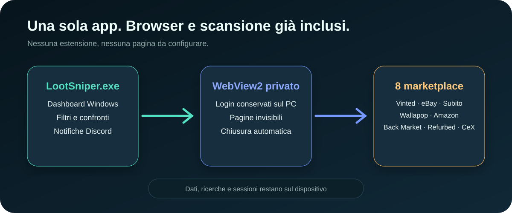

# LootSniper · radar tecnologico in locale

Cerca e confronta portatili gaming, componenti, NAS, server, router, smartphone e altra tecnologia su **Vinted, eBay, Subito, Wallapop, Amazon, Back Market, Refurbed e CeX**. LootSniper 9 apre una vera finestra Windows con browser WebView2 integrato: non richiede estensioni.

**Questa versione si esegue esclusivamente in locale.** GitHub distribuisce il progetto e la guida: non devi attivare GitHub Pages, configurare Supabase o inserire chiavi API. Per cercare nuovi annunci serve una connessione Internet; l’archivio già salvato si può consultare anche senza connessione.


*Le schermate di questa guida usano annunci sintetici di test, non offerte reali.*

## Installazione semplice per Windows

[⬇️ **Scarica LootSniper per Windows**](https://github.com/Fr3nK027/LootSniper/archive/refs/heads/main.zip)

1. Estrai completamente lo ZIP scaricato.
2. Apri la cartella estratta e fai doppio clic su **Installa LootSniper.cmd**.
3. Attendi il messaggio **Installazione completata**: si aprirà `LootSniper.exe` e troverai **LootSniper** sul desktop e nel menu Start.

Non servono privilegi di amministratore, Python, pip o Node.js. L’installer:

- installa il programma in `%LOCALAPPDATA%\Programs\LootSniper`;
- scarica una copia privata e isolata di Python 3.14.7 dal sito ufficiale Python;
- controlla il file scaricato con l’hash SHA-256 pubblicato da Python.org prima di estrarlo;
- installa l’app Windows autonoma e controlla Microsoft Edge WebView2;
- scarica automaticamente WebView2 dal sito Microsoft solo se non è già presente;
- crea i collegamenti con l’icona LootSniper e avvia app e server senza finestre CMD.

Il runtime rimane dentro l’installazione di LootSniper: non modifica il Python già presente sul PC e non aggiunge variabili di sistema. I componenti dell’app usano soltanto la libreria standard, quindi non vengono scaricati pacchetti da fonti aggiuntive. Dettagli: [pacchetto Python incorporabile](https://docs.python.org/3/using/windows.html#the-embeddable-package) e [Python 3.14.7](https://www.python.org/downloads/release/python-3147/).


Windows può mostrare un avviso perché lo script non è firmato digitalmente. Verifica che lo ZIP provenga dal repository `Fr3nK027/LootSniper`; quindi apri **Ulteriori informazioni → Esegui comunque** se l’avviso compare.

## Primo avvio

Ogni avvio mostra una configurazione guidata e lascia la dashboard pulita finché non hai deciso cosa cercare. Il percorso chiede, nell’ordine:

1. la tipologia principale e il prodotto, per esempio gaming, workstation, AI/hosting, NAS, server, componenti, smartphone o rete;
2. **Automatico**, per preparare tutti gli otto marketplace, oppure **Manuale**, per scegliere soltanto i siti e gli indirizzi desiderati;
3. i filtri facoltativi, presentati uno alla volta e sempre saltabili;
4. l’accettazione delle regole per l’uso locale del browser e dei propri account sui marketplace.

LootSniper non chiede né legge password o codici di accesso. Login, cookie e sessioni restano nel profilo WebView2 privato in `%LOCALAPPDATA%\LootSniper\BrowserProfile`; CAPTCHA e verifiche vanno completati personalmente. Il percorso si può riaprire in qualsiasi momento con **Nuova ricerca guidata**.

Il pulsante **Giorno / Notte** accanto al logo cambia l’aspetto della dashboard e ricorda la scelta. Al primo avvio LootSniper segue automaticamente il tema di Windows.


In seguito usa soltanto il collegamento **LootSniper** sul desktop o nel menu Start. L’app avvia il server locale e mostra la dashboard nella propria finestra. Non devi aprire Chrome, installare componenti dal Web Store o digitare `127.0.0.1:8765`.

Per chiudere subito premi **Arresta LootSniper** oppure chiudi la finestra. L’app arresta anche il server e le pagine di scansione; non rimane un CMD da chiudere.

### Uso portatile e avvio dal terminale

Se preferisci non installare il programma, serve Python 3.10 o successivo. Estrai lo ZIP e fai doppio clic su **avvia radar.vbs**, oppure apri un terminale nella cartella:

```powershell
py -3 launcher.py --background
```

In alternativa:

```text
python launcher.py --background
```

Su macOS e Linux puoi usare `python3 launcher.py --background` con Python 3.10+; installer, VBS e BAT sono specifici per Windows. I controlli effettuati per questa distribuzione sono su Windows.

Per la diagnostica con terminale visibile usa `python launcher.py` e chiudi con **Ctrl+C**. Per avviare soltanto il server usa `python server.py`: l’arresto alla chiusura delle schede è attivo solo con `--auto-stop`. Il pulsante **Arresta LootSniper** funziona anche in modalità manuale.

## Esegui una ricerca

1. Completa la configurazione iniziale e usa **Salta questo filtro** per ogni caratteristica che non vuoi imporre.
2. In modalità **Automatico**, LootSniper prepara gli URL degli otto marketplace dalla descrizione scelta. In modalità **Manuale**, puoi lasciare vuoti i siti che non vuoi controllare e incollare almeno un URL completo.
3. Controlla il riepilogo compatto nella barra laterale. Le sorgenti dettagliate restano raccolte sotto **Modifica sorgenti e parole chiave**.
4. In **Impostazioni → Ricerca** attiva **Più pagine** per leggere fino a cinque pagine per sito; disattivala per il controllo più rapido.
5. Premi **Esegui ricerca**. WebView2 apre le sorgenti in pagine invisibili, usa la sessione privata dell’app e importa gli annunci in autonomia. Il riquadro **Attività** mostra sito e pagina in corso.
6. Per fermare il lavoro premi **Interrompi ricerca**: quanto raccolto rimane salvato.

Ogni volta che premi **Esegui ricerca**, LootSniper svuota il radar precedente e riparte da zero. Anche un nuovo avvio azzera annunci, preferiti, filtri, importazioni e l’elenco temporaneo delle ricerche. Tema, configurazione Discord e file ricerca già scaricati rimangono disponibili.

I contatori **Bombe verificate**, **Questa sessione** e **Da tenere d’occhio** restano nascosti finché non esistono risultati. Dopo la ricerca, la vista iniziale **Bombe** mostra soltanto gli annunci che superano insieme le soglie di margine, completezza dei dati e condizioni. Premi **Tutti gli annunci** per vedere anche NAS, router, componenti e prodotti che richiedono un confronto manuale.

Per l’elettronica generica, LootSniper evidenzia soltanto caratteristiche scritte nell’annuncio: memoria, archiviazione, numero di bay, standard Wi-Fi, velocità di rete, 5G e Dual SIM. Nella tabella di confronto le stime non disponibili restano esplicitamente indicate come **confronto manuale**.

I marketplace possono bloccare le richieste HTTP o caricare i risultati tramite JavaScript. Per questo `LootSniper.exe` usa prima il browser incorporato. Se un sito mostra login, consenso o verifica, apri il suo collegamento dalla sezione sorgenti: apparirà una finestra WebView2 visibile con lo stesso profilo; completa il passaggio e ripeti la ricerca.

### Salva una ricerca

1. Prepara i link.
2. Scrivi un nome in **Nome della ricerca**.
3. Imposta, se servono, tipologia, storage, RAM, CPU, GPU, marca, condizioni, layout tastiera, budget, marketplace, ordinamento e **Più pagine**.
4. Premi **Salva**. Il browser scarica un file con un nome come `LootSniper-NAS-economici.json`.
5. Durante la sessione premi il nome per ricaricare la ricerca, **▶** per eseguirla o **×** per rimuoverla dall’elenco.
6. In futuro premi **Importa file ricerca**, scegli il JSON e controlla i dati caricati. Premi **Esegui ricerca** per avviarla.

Il file conserva nome, parole chiave, modalità automatica o manuale, marketplace, eventuali URL incollati, budget, filtri, ordinamento e profondità della scansione. Non contiene risultati, preferiti o webhook Discord. Puoi conservarlo in qualsiasi cartella, inviarlo a un altro PC con LootSniper o modificarlo con Blocco note.

Nel JSON, `sourceMode` può essere `auto` oppure `manual`. Modifica liberamente `name`, `query`, `filters` e `deepScan`. In modalità automatica usa `true` o `false` dentro `marketplaces`; in modalità manuale usa un URL completo oppure `false`:

- `true` per creare automaticamente il link del marketplace dalla nuova `query`;
- `false` per escludere quel marketplace;
- un URL HTTPS completo per mantenere filtri personalizzati impostati sul sito.

Questo formato non dipende dal tipo di prodotto: puoi creare profili per PC gaming, componenti, NAS, server, cellulari, router, monitor e altra elettronica. Conserva virgolette, virgole e parentesi del JSON; se la sintassi non è valida, LootSniper rifiuta il file e mostra il motivo senza cambiare la ricerca corrente.

L’elenco interno viene usato dal browser integrato soltanto durante la sessione e viene azzerato al riavvio. I file scaricati non vengono cancellati: sono il modo previsto per riutilizzare una ricerca in una sessione futura.

## Valuta, filtra e confronta

- I risultati iniziano subito accanto alla colonna dei filtri, così sullo schermo entrano più annunci e serve meno scorrimento.
- Il catalogo parte in modalità **Lista**: immagine a sinistra, caratteristiche e controlli al centro, prezzo e azioni a destra.
- Premi **Griglia** per una vista più compatta; LootSniper ricorda la vista scelta sul PC.
- Cerca un modello o una caratteristica nei risultati.
- Passa da **Bombe** a **Tutti gli annunci** per separare le opportunità classificate dal catalogo raccolto.
- Filtra per marketplace, budget massimo e differenza minima.
- Filtra per categoria: portatili gaming, componenti PC, NAS, router e rete, server, smartphone o altra elettronica. Il menu mostra quanti annunci sono presenti in ogni categoria.
- Il menu Marketplace mostra quanti annunci arrivano da ciascuno degli otto siti, così sai subito dove si concentra il catalogo.
- Imposta un prezzo minimo e massimo per restringere il catalogo a una fascia precisa; entrambi vengono conservati nei file ricerca riutilizzabili.
- Se il prezzo minimo supera il massimo, il catalogo indica subito come correggere la fascia invece di confonderla con una ricerca senza risultati.
- Attiva **Solo con foto** quando vuoi escludere gli annunci senza immagine; anche questa scelta viene conservata nel file ricerca.
- I filtri applicati compaiono sopra gli annunci: premi **×** su un singolo filtro per rimuoverlo senza perdere gli altri.
- I gruppi nella colonna laterale funzionano come nei marketplace: apri una sezione e seleziona uno o più valori. I valori dello stesso gruppo sono alternativi, mentre gruppi diversi si combinano. Nessuna selezione significa che quel gruppo non limita i risultati.
- Sono disponibili tipologia, tipo di storage, generazione e quantità RAM, famiglia e generazione CPU, serie GPU NVIDIA/AMD/Intel, marca, condizioni e layout tastiera. Quando la ricerca è gaming, gli annunci solo HDD vengono esclusi dalla preselezione, ma quelli con storage non indicato restano visibili.
- Premi la **stella** sulla scheda per salvarla nei preferiti.
- Usa **Solo preferiti** per restringere l’archivio.
- Scegli l’ordinamento; **Mostra altri 60 annunci** carica le schede successive.
- Apri rapidamente un’offerta sul marketplace premendo la sua immagine, il titolo oppure **Vedi l’annuncio**.
- Leggi il **Punteggio bomba**, il valore usato stimato, il prezzo nuovo indicativo, il margine percentuale, l’affidabilità dei dati e le condizioni dichiarate. Apri poi **Cosa verificare prima di comprare** per vedere quali informazioni mancano.

Le scorciatoie **Componenti PC**, **NAS**, **Server**, **Smartphone** e **Router** preparano subito tutti i marketplace. La parola chiave resta modificabile prima dell’avvio.

Per confrontare due o tre annunci:

1. Seleziona **Confronta** sulle rispettive schede.
2. Premi il pulsante **Confronta** nella barra in basso.
3. Leggi la tabella e chiudila con **×** oppure **Esc**.


Il **Punteggio bomba** combina lo sconto rispetto al valore usato stimato, la completezza delle specifiche, l’indice specifiche locale e le condizioni dichiarate. Per essere mostrato come occasione servono almeno l’8% di differenza, un margine minimo proporzionato al valore, affidabilità dati di almeno 70/100 e nessuna indicazione “da riparare”. L’affidabilità del venditore non viene inventata: la scheda ricorda di verificare feedback, anzianità dell’account e protezione acquisti sul marketplace. È un filtro prudente, non una garanzia di guadagno.

**Stime, prezzo nuovo indicativo e indice specifiche sono calcoli locali:** non sono quotazioni aggiornate, benchmark Versus o una garanzia di rivendita. La scheda offre **Verifica su Versus** per aprire una ricerca esterna senza attribuire a Versus dati che il sito non ha fornito all’app. Controlla sempre configurazione, condizioni, venditore, spedizione e commissioni nell’annuncio originale. I rialzi e ribassi si basano sui prezzi osservati da LootSniper, non su uno storico completo del marketplace.

## Browser integrato

La versione 9 usa Microsoft Edge WebView2, mantenuto e aggiornato da Microsoft. Il profilo è separato da Chrome ed Edge personali e viene usato soltanto da LootSniper. Premendo il collegamento di un marketplace si apre una finestra interna visibile per login, consenso cookie o verifiche; chiudendola torni alla dashboard. Le scansioni successive riutilizzano la sessione locale.



Il motore apre una sorgente alla volta per contenere memoria e carico dei marketplace, blocca il download di immagini e video nelle pagine invisibili e chiude ogni pagina dopo l’analisi. Titolo, prezzo, indirizzo, testo visibile e URL dell’immagine vengono passati al server locale; password e campi di accesso non vengono letti.

## Notifiche Discord: pubblica le bombe nel tuo canale

Questa funzione è facoltativa e inizialmente disattivata. Non serve creare un bot. Le notifiche automatiche riguardano le occasioni gaming per cui LootSniper dispone di una stima; NAS, router e prodotti generici rimangono nel radar per il confronto manuale.


1. Nel tuo server Discord apri **Impostazioni server → Integrazioni → Webhook**. Serve il permesso di gestire i webhook.
2. Crea un webhook, scegli un **canale testuale** e copia l’URL. Questa versione non configura thread di canali forum.
3. Nella dashboard apri **Impostazioni → Discord · pubblica le bombe**.
4. Incolla l’URL nel campo **URL webhook Discord**.
5. Imposta la **Differenza stimata minima (€)**: per esempio 200 invia soltanto nuove opportunità con almeno 200 € di differenza tra stima e prezzo.
6. Attiva **Pubblica le nuove bombe** e premi **Salva Discord**.
7. Premi **Invia messaggio di prova** e verifica il messaggio nel canale. Il pulsante usa il webhook già salvato.
8. Avvia una ricerca con il browser integrato. Solo le nuove opportunità classificate come bombe vengono pubblicate con titolo, link, prezzo, valore stimato, margine, punteggio, affidabilità dei dati e condizioni dichiarate.

Gli annunci già presenti nell’archivio prima dell’attivazione non vengono pubblicati in blocco. Gli invii confermati vengono ricordati per gli ultimi 10.000 identificativi, anche dopo un riavvio; le normali variazioni di prezzo non producono nuovi messaggi. La coda conserva fino a 200 invii, rispetta le attese richieste da Discord e riprova gli errori di rete temporanei fino a tre tentativi. Lo stato degli invii compare sotto i pulsanti. Le menzioni automatiche come @everyone sono disabilitate.

Per fermare le notifiche disattiva **Pubblica le nuove bombe** e premi **Salva Discord**: gli invii ancora in coda vengono annullati. **Rimuovi webhook** elimina la configurazione del canale. Una richiesta già partita può comunque completarsi.

Il webhook è conservato in **radar-discord.json**, escluso da Git e dal pacchetto distribuibile. Il backup della dashboard non contiene il webhook: su un altro PC va configurato di nuovo. Non pubblicare questo file e non incollare l’URL nel README. Quando attivi Discord, i dati delle nuove opportunità vengono inviati al canale scelto; ricerche salvate e altri archivi restano locali. Dettagli tecnici: [webhook Discord](https://docs.discord.com/developers/resources/webhook), [limiti degli invii](https://docs.discord.com/developers/topics/rate-limits).

## Backup, ripristino e aggiornamenti

### Esporta e ripristina

1. Premi **Esporta backup** e conserva il file JSON.
2. Per ripristinarlo, anche su un altro PC, avvia LootSniper e premi **Importa backup**.
3. Seleziona il file: gli annunci vengono uniti per identità e vengono recuperati preferiti e ricerche compatibili.

Se non hai annunci ma vuoi salvare le ricerche, usa **Archivio → Backup completo**.

**Archivio → Svuota archivio** conserva una copia recuperabile con **Annulla svuotamento**, anche dopo un ricaricamento. Il recupero resta disponibile finché i dati del browser sono conservati. Gli annunci svuotati possono rientrare se aggiornati o trovati da una nuova scansione.

### Dove sono i dati

| Dato | Dove si trova |
| --- | --- |
| Elenco temporaneo usato dall’app | `radar-searches.json`, azzerato a ogni avvio |
| Profili di ricerca modificabili | File `LootSniper-*.json` nella cartella download scelta nel browser |
| Annunci importati dal browser integrato | `radar-imports.json`, azzerato a ogni avvio |
| Risultati, preferiti, filtri e recupero archivio | Profilo WebView2 locale, azzerato per ogni nuova sessione |
| Login, cookie e sessioni marketplace | `%LOCALAPPDATA%\LootSniper\BrowserProfile` |
| Configurazione privata Discord, coda e invii confermati | `radar-discord.json` |
| Diagnostica del server e dell’avvio nascosto | `radar-server.log`, `radar-avvio.log` |
| Backup esportati | Cartella download scelta nel browser |

I file dati vengono creati quando necessari. Un progetto appena scaricato parte senza i tuoi archivi personali.

### Aggiorna il programma

1. Esporta un backup prima dell’aggiornamento.
2. Premi **Arresta LootSniper** nella vecchia dashboard.
3. Scarica ed estrai il nuovo ZIP.
4. Esegui di nuovo **Installa LootSniper.cmd**. L’installer aggiorna i file del programma, riusa il runtime già verificato e conserva la configurazione Discord. Ricerche e importazioni ripartono vuote al successivo avvio.
5. Riapri **LootSniper**: eseguibile, server e parser sono già aggiornati insieme.

Per conservare annunci o preferiti oltre la sessione, usa **Esporta backup** prima di chiudere e **Importa backup** nella sessione successiva.

### Disinstalla completamente

1. Apri il menu Start e cerca **Disinstalla LootSniper**. In alternativa, fai doppio clic su **Disinstalla LootSniper.cmd** nella cartella scaricata o in `%LOCALAPPDATA%\Programs\LootSniper`.
2. Scrivi **S** quando viene richiesta la conferma.
3. Attendi il messaggio **LootSniper è stato disinstallato completamente**.

Il disinstallatore prova prima l’arresto normale, poi chiude automaticamente `LootSniper.exe` e gli eventuali processi di supporto avviati dalla cartella. Rimuove programma, runtime Python, profilo WebView2, login locali, ricerche, importazioni, log e configurazione Discord. Cerca inoltre i collegamenti sia nel Desktop standard sia nei Desktop spostati in OneDrive.

I backup che hai esportato in Download o in altre cartelle rimangono disponibili. La cartella ZIP estratta manualmente da GitHub non fa parte dell’installazione: puoi eliminarla normalmente dopo la disinstallazione.

## Risoluzione dei problemi

| Problema | Cosa fare |
| --- | --- |
| Il download automatico non parte | Controlla che `python.org` e `microsoft.com` non siano bloccati da firewall o proxy; poi riavvia `Installa LootSniper.cmd`. |
| L’installer segnala che LootSniper è aperto | Premi **Arresta LootSniper** nella dashboard e riprova. |
| Dopo la disinstallazione resta l’icona sul Desktop | Usa il disinstallatore 6.6 o successivo: controlla anche OneDrive e forza l’aggiornamento del Desktop. |
| Windows mostra un avviso | Verifica di aver scaricato dal repository ufficiale, poi usa **Ulteriori informazioni → Esegui comunque**. |
| Python non trovato nella modalità portatile | Installa Python 3.10+ e verifica `py -3 --version`, oppure usa l’installer automatico. |
| `LootSniper.exe` non si apre | Reinstalla l’app e verifica Windows Update; WebView2 viene controllato automaticamente dall’installer. |
| Porta 8765 occupata | Arresta la vecchia copia; non avviare due copie diverse insieme. |
| Server offline | Chiudi la scheda e riapri LootSniper dal collegamento sul desktop o nel menu Start. |
| Discord non invia | Salva un webhook valido, prova il messaggio di test e controlla soglia e stato. La dashboard deve essere aperta per rilevare nuove bombe. |
| Nessuna opportunità trovata | Azzera i filtri, controlla i link e il riquadro Attività; verifica se gli annunci rientrano nei criteri hardware e prezzo. |
| Un marketplace non viene letto | Apri il suo collegamento nella sezione sorgenti, completa eventuale consenso, login o verifica nella finestra interna e ripeti la ricerca. |
| Il browser integrato non risponde | Chiudi LootSniper, riaprilo e controlla che Microsoft Edge WebView2 sia aggiornato. |
| Ricerche non sincronizzate | Ricarica la dashboard a server attivo. Se compare, usa **Recupera ricerche dalla copia locale**. |
| Archivio apparentemente vuoto | Dopo un riavvio o una nuova ricerca è normale: LootSniper riparte da zero. Per recuperare dati precedenti importa un backup esportato. |
| File dati danneggiato | Il file viene conservato. Arresta il server e ripristina una copia valida; non cancellarlo senza un backup. |

## Pubblicare o contribuire

Il repository contiene l’app Windows, il server locale, il browser integrato, test e immagini della guida. Non occorre configurare un servizio cloud.

**Per preparare una copia distribuibile**, dalla cartella del progetto esegui:

```powershell
py -3 crea_pacchetto.py
```

Troverai **dist/LootSniper-Windows.zip**. Il pacchetto include soltanto i file previsti, senza ricerche personali, annunci, webhook, log o cache. Puoi allegarlo a una release GitHub oppure estrarlo e caricare il contenuto nella radice del repository.

Con Git, `.gitignore` esclude gli archivi personali. Se usi il caricamento manuale dal sito GitHub, usa il contenuto del pacchetto pulito: il caricamento manuale non applica `.gitignore`. Carica anche **docs/images**, altrimenti le immagini nel README non saranno visibili.

### Verifica per sviluppatori

Python usa soltanto la libreria standard. Node.js serve esclusivamente per i test JavaScript:

```text
python -B -m unittest discover -s tests -v
node --test tests/core.test.js tests/app.test.js tests/theme.test.js tests/markup.test.js
```

Per un’anteprima con annunci sintetici, isolata dai dati reali:

```text
python -B tests/preview_server.py
```

Apri [la dashboard di test](http://127.0.0.1:8766/) o [i test del parser](http://127.0.0.1:8766/tests/listings.html). Arresta il server di test con **Ctrl+C**.

| File o cartella | Funzione |
| --- | --- |
| `Installa LootSniper.cmd`, `installa.ps1`, `distribuzione.json` | Installazione Windows, dipendenze verificate e collegamenti |
| `Disinstalla LootSniper.cmd`, `disinstalla.ps1` | Disinstallazione completa e rimozione dei dati locali dell’app |
| `desktop/` | Sorgente WinForms/WebView2 e pacchetto di `LootSniper.exe` |
| `launcher.py`, `avvia radar.vbs` | Modalità portatile precedente per sviluppatori |
| `server.py` | Server locale e gestione degli archivi |
| `radar usato 3 market.html`, `styles.css`, `experience.css`, `app.js`, `radar-guide.js` | Dashboard e avvio guidato |
| `radar-core.js` | Prezzi, validazione e stime hardware |
| `radar-runtime.js`, `radar_lifecycle.py` | Impostazioni, presenza delle dashboard e arresto automatico |
| `radar_discord.py` | Configurazione privata, coda e invio delle notifiche Discord |
| `browser-bridge/listings.js` | Parser condiviso degli annunci usato dal browser integrato |
| `assets/` | Icona del programma |
| `docs/images/` | Immagini della guida |
| `tests/` | Test automatici e anteprima isolata |

Il server ascolta soltanto su **127.0.0.1**, verifica gli URL dei marketplace e non serve al browser i file Python o gli archivi JSON come file pubblici.
